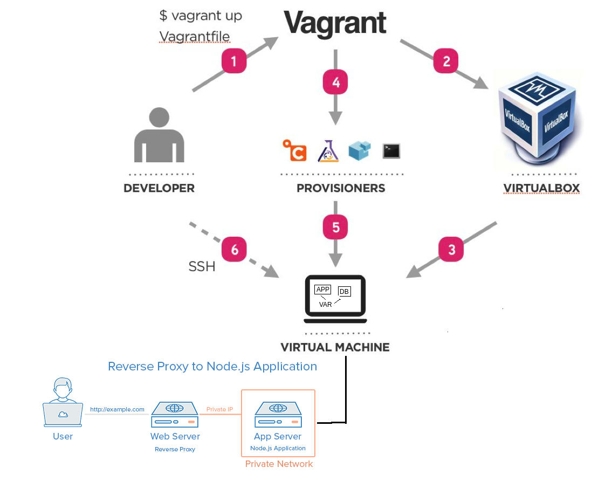

# Multi Machine Vagrant

## Summary

The sample application has the ability to connect to a database. We need to provision our development environment with a vm for the app and one for the database.

Vagrant is capable of running two or more virtual machines at once with different configurations.



## Tasks

- Research how to create a multi machine vagrant environment.
- Add a second virtual machine called "db" to your Vagrant file.
- Configure the db machine with a different IP from the app.
- Provision the db machine with a MongoDB database.

## Notes

When you have the second machine running further configuration of the app is required to make it use the database. We will cover this in the next lesson.

You can test your database is working correctly by running the test suite in the test folder. There are two sets of tests. One for the app VM and one for the db VM. Make them all pass.

````
cd test
rake spec
````

## Acceptance Criteria

- Uses vagrant file
- Create 2 VM APP and Mongodb
- Localhost set to development.local
- App works on Port 3000 (development.local:3000)
- Work with only command "vagrant up" &/or mininum commands
- All tests passing
- works on /posts
- works on /fibonacci/30
- Documentation exists as README.md file
- Documentation includes: Intro (purpose of repo), Pre Requisits and Intructions
- Instructions have a clear step by step
- repo exists on github

**__Resources__**:

https://www.vagrantup.com/docs/multi-machine

## Solution

As the objective is to be able to deploy a machine with the application and another with the database, we will first proceed to test everything on a single machine.

- We proceed to create the `Vagrantfile` file in the same directory of the project, in which we will define the configuration of the virtual machine, and type the following configuration:

````ruby
Vagrant.configure("2") do |config|

  config.vm.define "app" do |app|
    app.vm.box = "ubuntu/xenial64"
    app.vm.network "forwarded_port", guest: 80, host: 8080
    app.vm.network "forwarded_port", guest: 3000, host: 8081
    #app.vm.network "private_network", ip: "192.168.10.100"
    #app.hostsupdater.aliases = ["development.local"]
    app.vm.synced_folder "app", "/home/vagrant/app"
  end
end
````

- We proceed to open the git bash terminal in as administrator. We are located in the directory where we have saved the `Vagrantfile` file and run the next command:

`vagrant up`

- As soon as it has been loaded, we proceed to check if the status is running with the following command:

`vagrant status`

If everything is working correctly we proceed to connect to the machine.

- `vagrant ssh`

- Then we proceed to open another git bash terminal in administrator mode and proceed to locate ourselves in the tests folder and execute the following command:

`rake spec`

We will be able to observe the failures that we have due to the dependencies that we have to install in order to run the app. We can say that  ruby ​​run dependency tests.

- Wherewith in the other terminal where we have established the connection with the machine we proceed to solve each of the errors with the following commands:

````
# run the update command
sudo apt-get update -y

# upgrade command
sudo apt-get upgrade -y

# install nginx
sudo apt-get install nginx -y

# install nodejs with required version and dependecies
sudo apt-get install python-software-properties

curl -sL https://deb.nodesource.com/setup_6.x | sudo -E bash -
sudo apt-get install nodejs -y

# install npm with pm2 -g
sudo npm install pm2 -g
````

We run the tests again and we will see that next we no longer have errors related to the app. All those tests have passed successfully.

- In the app, inside the terminal git bash connected to the machine, do `cd app/app/` and then `sudo npm install`

- After that run the app `node app.js`. Check the port, go to the browser and insert `localhost:port_given_in_app`, to see if the app is running and listenning.

- But then we proceed to see errors that are related to the database. Wherewith we proceed to do the same, solve each of the failures connected to the machine with the following commands:

````
# run the update command
sudo apt-get update -y

# upgrade command
sudo apt-get upgrade -y

# Let's configure mongodb
wget -qO - https://www.mongodb.org/static/pgp/server-3.2.asc | sudo apt-key add -
echo "deb http://repo.mongodb.org/apt/ubuntu xenial/mongodb-org/3.2 multiverse" | sudo tee /etc/apt/sources.list.d/mongodb-org-3.2.list

# upgrade command
sudo apt-get update

# Install mongodb
sudo apt-get install -y mongodb-org=3.2.20 mongodb-org-server=3.2.20 mongodb-org-shell=3.2.20 mongodb-org-mongos=3.2.20 mongodb-org-tools=3.2.20

# Edit mongodb-config
sudo mkdir -p /data/db
sudo chown -R mongodb:mongodb /var/lib/mongodb

# change ip
sudo sed -i 's/127.0.0.1/0.0.0.0/g' /etc/mongod.conf

# Start mongodb
sudo systemctl enable mongod
sudo systemctl start mongod
````

We proceed to execute all the tests and we can see that everything has passed correctly.

Wherewith we already have the two roles ready. But what we want is to run the app on one machine and the database on another.

- Apart from that, we don't want to have to connect to the machines manually and solve each of the dependencies. Wherewith it is here when we proceed to automate our processes. Let's automate the installation of required dependecies in our vagrant file to run our script. We will create two scripts which will be in charge of installing each of the dependencies on their own. In the `environment` folder we can see these two scripts with the commands that we have previously executed. The `provision.sh` file is for the app and the` provisiondb.sh` file is for the database. Create an easily accessable .sh file with linux code.

- Once we have prepared the two saved scripts, we proceed to configure the two virtual machines with their respective scripts in the `Vagrantfile` file as follows, define multiple VM's:

````ruby
Vagrant.configure("2") do |config|

  config.vm.define "app" do |app|
    app.vm.box = "ubuntu/xenial64"
    app.vm.network "forwarded_port", guest: 80, host: 8080
    app.vm.network "forwarded_port", guest: 3000, host: 8081
    #app.vm.network "private_network", ip: "192.168.10.100"
    #app.hostsupdater.aliases = ["development.local"]
    app.vm.synced_folder "app", "/home/vagrant/app"
    app.vm.provision "shell", path: "environment/app/provision.sh", privileged: false
  end

  config.vm.define "db" do |db|
    db.vm.box = "ubuntu/xenial64"
    db.vm.network "forwarded_port", guest: 27017, host: 27017
    #app.vm.network "private_network", ip: "192.168.10.100"
    db.vm.synced_folder "app", "/home/vagrant/app"
    db.vm.provision "shell", path: "environment/app/provisiondb.sh", privileged: false
  end
  
end
````

- We proceed to close the virtual machine that we have created and destroy it with the following commands from git bash in the directory where we have everything located:

`vagrant halt`

`vagrant destroy`

- Once we have everything ready, we proceed to deploy both machines with everything installed correctly:

`vagrant up`

Once everything has been executed correctly we proceed to execute all the tests again to see if the two machines have been configured correctly.

If everything went correctly, we have deployed our two servers correctly. We can connect with `ssh` to check any service or run the app. Also in virtual box we can see that the two machines are running.

## Create Environment Variables

An enviroment variable is a dynamic-named value that can affect the way running processes will behave on a computer.

- `printenv`: prints all variables
- `printenv VARNAME`: print the value of a specific variable
- `VARNAME="var_value"`: to create a variable
- `export VARNAME="var_value":` to create environment variables
- `echo "export VARNMAE='var_value'" >> ~/.bashrc`: how to create a persistent variable. If you want to persist the PATH variable, you have to edit the .bashrc file.

- We proceed to create our environment variable to connect the application with the database, in the `Vagrantfile` file in the code part corresponding to the application:

`app.vm.provision "shell", inline: 'sudo echo "export DB_HOST=mongodb://192.168.10.101:27017/posts" >> /home/vagrant/.bashrc'`

- We proceed to restart our machines and in this way we proceed to connect to the app, access the `cd app` folder, and execute `npm install` to resolve dependencies, `node seeds/seed.js` to obtain the information from the database and then launch the app `node app.js`. It should show the message of the port where it is listening.

- We proceed to access our browser and enter the following link: `http://development.local:3000/posts`. It will show you all the posts from the database.

## Reverse Proxy with NGINX

Nginx is an open-source web server that, since its initial success as a web server, is now also used as reverse proxy, HTTP cache, and load balancer.

Some common features seen in Nginx include:
- Reverse proxy with caching
- IPv6
- LOad balancing
- WebSockets

A reverse proxy sits in front of a web server and receives all the requests before they reach the origin server. Reverse proxies are typically used to enhance performance, security, and reliability of the web server.

When you browse the web normally by entering a domain name or clicking a link, your browser/device connects to the website’s server directly and starts downloading its resources.

A reverse proxy server acts as a front for the origin server to maintain anonymity and enhance security, just like how a user/client can use a forward proxy to achieve the same. It ensures that no user or client communicates directly with the origin server.

- In this case, what we want is that the user does not have to write the port in order to access our service. Nobody in the normal routine writes the port. Wherewith we proceed to create the code to make the user instead of entering `development.local:3000` to see the application have to enter only `development.local`. For them we will use the reverse proxing with NGINX functionality.

- What is the default location of our NGINX file that loads the NGINX page: `cd /etc/nginx/sites-available/`

- `nano /etc/nginx/sites-available/default` : we have here the configuration of the reverse proxing.

- We need to use the default file in the same location to add our code to use it as our reverse proxy.

- We proceed to automate this modification, wherewith we add the following code in the `provision.sh` file of the app:

````bash
# NGINX reverse proxy automation
sudo echo "server {
    listen 80;

    server_name _;

    location / {
        proxy_pass http://localhost:3000;
        proxy_http_version 1.1;
        proxy_set_header Upgrade \$http_upgrade;
        proxy_set_header Connection 'upgrade';
        proxy_set_header Host \$host;
        proxy_cache_bypass \$http_upgrade;
    }
}" | sudo tee /etc/nginx/sites-available/default

sudo systemctl restart nginx
````

- We proceed to restart our machines and in this way we proceed to connect to the app, access the `cd app` folder, and execute `npm install` to resolve dependencies, `node seeds/seed.js` to obtain the information from the database and then launch the app `node app.js`. It should show the message of the port where it is listening.

- We proceed to access our browser and enter the following link: `http://development.local/posts`, without the port.

Finally it will show you the information and it means that we have configured our environment with two machines and connecting with each other through an environment variable.
